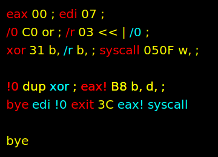

# Blue

Blue is a single-pass bytecode interpreter for a [colorForth](https://colorforth.github.io/index.html) dialect.
Unlike the traditional `colorForth` system, Blue is a single shot application with a sole focus on generating
output, which is typically an artisanal binary. Its simplistic nature makes it hard to describe, but think of an
assembler with no target architecture, output format or separate macro syntax where any label can be called at
assemble time or used as a macro. This is why I think of Blue as a
`colorForth`/[fasmg](https://flatassembler.net/docs.php?article=fasmg) love child.

Blue aims to:

1. Have a reasonably small, simplistic and hackable codebase
1. Be something that a single human can completely understand
1. Help create minimalistic handcrafted applications
1. Bring some fun back into the world

This is the reference implementation for x86_64 GNU/Linux.

## Fair Warning

It is important to realize that using Blue is agreeing to step into a world of brutal simplicity and minimalism.
There are zero guardrails. You will not get an error message let alone a helpful one. Segfaults will happen and
debugging often means taking a walk to think about what you've done wrong. Hand jitting some machine code will be
required to do anything non trivial. You will be responsible for and will understand the role of every byte that
lands in the output.

## Fair Warning, Illustrated

When using Blue you will start with virtually nothing and craft exactly what you need, brick by brick. With a 
small number of definitions your code quickly goes from low to high level. As an example:



> The astute reader will realize that the red `eax` is not used and the red `eax!` can be factored out to
> something like `mov/ri4` that is `B8 + b, d, ;`. Then `eax!` becomes `eax mov/ri4`. This is how factoring
> works. Building up a vocabulary to desribe and solve the problem at hand is a common theme with Blue and
> other [concatenative languages](https://en.wikipedia.org/wiki/Concatenative_programming_language).

Here red defines a new word. Yellow numbers are pushed on the stack at assemble time. Yellow italicized words are
opcodes that run at assemble time. The `b,` for example will pop a value off the stack and compile a byte to the
output. Cyan causes a word to be treated like a macro. Yellow words are called at assemble time. There are more
colors, styles and opcodes - these are just what is shown here.

This example is essentially the same as when you assemble:

```
bye:
	xor	edi, edi
exit:
	mov	eax, 60
	syscall

call	bye	; except this is run at assemble time
```

## On Colors

By default Blue bytecode is visualized using colors (like `colorForth`) and styles, adding another dimension by
which information can be relayed to the reader. There is no requirement to use these colors or any colors at
all. You can easily write a bytecode viewer that uses any means desired to display the bytecode. In the example
above, the yellow `bye` means that word is to be called at assemble time. If yellow is not agreeable, make it pink
or underlined, or display it as `@bye`. If you like reading verbose code, display it as `callAtAssembleTime(bye)`.

Running `./bin/btv < obj/btv/ops.bo` will show how each opcode is displayed, including its color and styling.
This is also an example of higher level Blue code.

## Forth Data Structures

Blue has a `dictionary` that can hold up to 256 entries. Each entry associates the address of the current location 
for the input and output buffers at the time the word is defined. If the word is used as a macro its location in 
the input buffer is used, if the word is called its location in the output buffer is used. The dictionary only 
exists at assemble time.

The `data stack` used by Blue is a circular buffer with a capacity for 16 elements. If this is limiting I would
argue that you are doing something wrong. I have yet to use more than 3 elements in concert at a given time. The
wrapping stack is very freeing, you don't have to worry about `drop`s as much or over/underflows. This is
especially relevant when defining macros.

The `return stack` is `rsp`. Like the dictionary the stacks only exist at assemble time.

## Building

Install [fasm v1](https://flatassembler.net/) then run `make` or `make -s -j 8`. Once finished `./bin/blue` will be
available along with bytecode files in `./obj`. `./bin/btv` can be used to view any file in `./obj` that is passed
via stdin. `./bin/examples` contains example binaries built with Blue.

It is worth poking around in the `bin` directories and noting the size of the binaries.

## Running

Blue will interpret up to 8192 bytes of bytecode from stdin. When finished it will write up to 8192 bytes of your
output to stdout.

## Working With Blue Bytecode

By convention Blue bytecode files have a `.b` extension. A `.bo` file indicates partial bytecode that is meant to
be joined into a complete `.b` file. This "linking" step is typically done with `cat`. Breaking code out into
separate `.bo` files aids in code reuse and can speed up build times when `make -j 8` or similar is run. The
`Makefile` shows how bytecode is built/combined and intepreted to build standalone binaries.

Currently there is no bytecode editor like you would see in a traditional `colorForth` system. I am using `fasm`
to build `.bo` files from `.bo.asm` files. This is likely to change at some point, or I may just write some macros
to make this less tedious. 

`make` will also build `./bin/btv` the Blue Terminal Viewer. Running `./bin/btv < file.b` or `./bin/btv < file.bo`
will print the bytecode in a format that one would expect when working with a `colorForth` code file. `btv` is a
complete binary written in Blue.

## Opcodes

Opcodes are defined in `b.inc` and are subject to change.

## Reading

Some links that may help fill in some back story/knowledge in no particular order:

1. [1x Forth](https://www.ultratechnology.com/1xforth.htm)
1. [POL](https://colorforth.github.io/POL.htm)
1. [x86 Instruction Reference](https://www.felixcloutier.com/x86/)
1. [x86-64 Registers](https://wiki.osdev.org/CPU_Registers_x86-64)

## TODOs

1. Make `$>` just push its addr, use `! @` to read/write
1. Add BC_TOR, BC_FROMR

## Blue in Blue (bib)

1. Move btv/fin.bo.asm to blue
1. Move btv/elf.fin.bo.asm to blue
1. Add tests, start getting them to pass in bib
   1. fin
   1. nl
   1. num_comp
1. When all done
   1. Rename blue.asm to bootstrap.asm
   1. Rename bib.b to blue.b
   1. Use bin/bootstrap to build bin/blue from blue.b

### btv

1. Multiple dst writes based on size (needs btv save/restore)
1. Factor enough so that `dstout` calls `print`, remove `writedst`
1. Add btv/README.md, move this stuff there
1. Factor `ashex` so `hexnum` can move to lib
1. Move ansi terminal stuff to lib
1. Factor hexnum more
1. That trailing space that looks like a leading space issue
