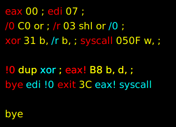

# Blue

Blue is a single-pass bytecode interpreter for a [colorForth](https://colorforth.github.io/index.html) dialect.
Unlike the traditional `colorForth` system, Blue is a single shot application with a sole focus on generating
output, which is typically a binary. Its simplistic nature makes it hard to describe, but think of an assembler
with no target architecture or file format where any label can become a macro or called at assemble time - as if
`colorForth` and [fasmg](https://flatassembler.net/docs.php?article=fasmg) had a baby.

Blue aims to:

1. Have a reasonably small, simplistic and hackable codebase
1. Be something that a single human can completely understand
1. Help create minimalistic handcrafted applications
1. Bring some fun back into the world

This is the reference implementation for x86_64 GNU/Linux.

## Fair Warning

It is important to realize that using Blue is agreeing to step into a world of brutal simplicity and minimalism.
There are zero guardrails. You will not get an error message let alone a helpful one. Segfaults will happen and
debugging often means taking a walk to think about what you've done wrong. Hand jitting some machine code will be
required to do anything non trivial. You will be responsible for and will understand the role of every byte that
lands in the output.

## Fair Warning, Illustrated

When using Blue you will start with virtually nothing and craft exactly what you need, brick by brick. With a 
small number of definitions your code quickly goes from low to high level. As an example:



This example is essentially the same as when you assemble:

```
bye:
	xor	edi, edi
exit:
	mov	eax, 60
	syscall

call	bye	; except this is run at assemble time
```

## On Colors

By default Blue bytecode is visualized using colors (like `colorForth`) and styles, adding another dimension by
which information can be relayed to the reader. There is no requirement to use these colors or any colors at
all. You can easily write a bytecode viewer that uses any means desired to display the bytecode. In the example
above, the yellow `bye` means that word to be called at assemble time. If yellow is not agreeable, make it pink
or underlined, or display it as `@bye`. If you like reading verbose code, display it as `callAtAssembleTime(bye)`.

Running `./bin/btv < obj/btv.bo` will show how each opcode is displayed, including its color and styling. This is
also an example of higher level Blue code.

## Building

Install [fasm v1](https://flatassembler.net/) then run `make` or `make -s -j`. Once finished `./bin/blue` will be
available along with bytecode files in `./obj`.

## Running

Blue will interpret up to 8192 bytes of bytecode from stdin. When finished it will write up to 8192 bytes of your
output to stdout.

## Working With Blue Bytecode

By convention Blue bytecode files have a `.b` extension. A `.bo` file indicates partial bytecode that is meant to
be joined into a complete `.b` file. This "linking" step is typically done with `cat`. Breaking code out into
separate `.bo` files aids in code reuse and can speed up build times when `make -j` or similar is run. The
`Makefile` shows how bytecode is built/combined and intepreted to build standalone binaries.

Currently there is no bytecode editor like you would see in a traditional `colorForth` system. I am using `fasm`
to build `.bo` files from `.bo.asm` files. This is likely to change at some point, or I may just write some macros
to make this less tedious. 

`make` will also build `./bin/btv` the Blue Terminal Viewer. Running `./bin/btv < file.b` or `./bin/btv < file.bo`
will print the bytecode in a format that one would expect when working with a `colorForth` code file. `btv` is a
complete binary written in Blue.

## Opcodes

Opcodes are described in `b.inc` and are subject to change.

## Reading

Some links that may help fill in some back story/knowledge in no particular order:

1. [1x Forth](https://www.ultratechnology.com/1xforth.htm)
1. [POL](https://colorforth.github.io/POL.htm)
1. [x86 Instruction Reference](https://www.felixcloutier.com/x86/)
1. [x86-64 Registers](https://wiki.osdev.org/CPU_Registers_x86-64)

## TODOs

1. Generalize elf.fin.bo
1. Add BC_SAVE, BC_RESTORE
1. Add BC_TOR, BC_FROMR
1. Factor hexnum more
1. Write Blue in Blue

### btv

1. Move ashex to btv
1. `num ashex` to `hexnum`
1. Multiple dst writes based on size (needs BC_SAVE/RESTORE)
1. That trailing space that looks like a leading space issue
